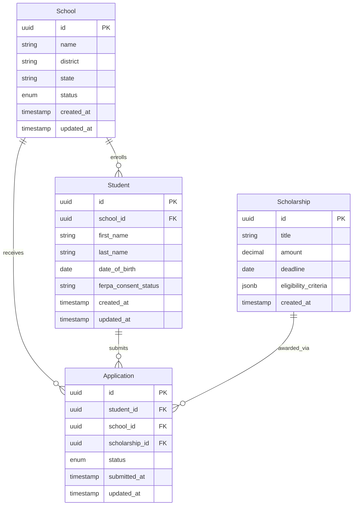

Design data models, schemas, and migration patterns. Covers
entity-relationship modeling, schema definition (DDL or ORM
models), multi-tenancy strategy selection, and migration
patterns.

This command sits between architecture (where data layout is a
structural decision) and implementation (where ORMs/migrations
do the actual work). Skillz produces design artifacts that
inform implementation; the implementation tools (Flyway,
Liquibase, Prisma migrations, etc.) own the runtime.

## Actions

| Action | What it does |
| --- | --- |
| `model` | Design entities and relationships (ER diagram) |
| `schema` | Define schema (DDL or ORM model file) |
| `migrate` | Plan a data migration (schema change with backfill considerations) |
| `review` | Audit existing models against design principles |

## Phase 0: discovery

1. Read `product/.pencil-architecture.json`. Note `multiTenancy`
   strategy and `techStack.database`.
2. Read `product/.pencil-decisions.json`. Surface accepted ADRs
   with tags: `data`, `multi-tenancy`, `schema`, `migration`.
3. List existing models in `design/data-models/`.
4. If `<entity-or-domain>` matches existing model, load it.

## Action: model

Designs entities and their relationships.

### Phase 1: domain definition

Prompt:

> What's the domain you're modeling? (e.g., "student records",
> "billing", "scholarship matching")

The domain becomes the model file name:
`design/data-models/<domain-slug>.md`. One model file per
domain; multiple entities per file.

### Phase 2: entity-by-entity

For each entity, capture:

- **Name** (singular, PascalCase: `Student`, `School`,
  `Scholarship`)
- **Description** (1-2 sentences)
- **Identity** (how is an instance uniquely identified?
  surrogate key — UUID, sequential — or natural key)
- **Attributes** (each attribute with name, type, nullability,
  constraints)
- **Relationships** (to other entities — one-to-one, one-to-many,
  many-to-many; mandatory or optional)
- **Lifecycle** (mutable, immutable, soft-delete, hard-delete,
  archival pattern)
- **Audit needs** (created_by/at, updated_by/at, version for
  optimistic locking)

For multi-tenant projects, surface tenant scoping:

> Project multi-tenancy strategy is `schema-per-tenant`. Each
> entity here is implicitly tenant-scoped (lives in a tenant
> schema). No `tenant_id` column needed; tenant is determined
> by the schema. Confirm? [Y/n]

If `row-level` strategy:

> Project multi-tenancy strategy is `row-level`. Every entity
> needs a `tenant_id` column. Adding `tenant_id` (NOT NULL,
> indexed) to all entities. Confirm? [Y/n]

### Phase 3: ER diagram generation

Generate a mermaid ER diagram:



Stored at
`design/data-models/<domain-slug>.md` with the diagram embedded
plus written entity descriptions, attribute lists, and
relationship explanations.

### Phase 4: ADR opportunity surfacing

Surface decisions worth ADR-ifying:

- **Identity strategy** (UUIDv7 vs sequential vs natural; once
  chosen, hard to change)
- **Soft-delete vs hard-delete policy** (compliance often forces
  this)
- **Audit column convention** (which entities get
  created_by/updated_by, and what's the user reference shape —
  user_id FK, principal claim, system event sentinel?)
- **Polymorphic associations** (many-to-many through join
  tables vs single-table inheritance vs separate tables)
- **JSON columns vs structured** (jsonb is convenient but
  loses type safety and constrains queries)
- **Multi-tenancy strategy** (if not already accepted)

## Action: schema

Translates a model into actual schema definitions.

### Phase 1: target storage

If `--storage` is provided, use it. Otherwise default to
`techStack.database` from `.pencil-architecture.json`.

Supported targets:

- **postgres** — SQL DDL (CREATE TABLE, CONSTRAINT, INDEX)
- **mysql** — SQL DDL with MySQL idioms
- **dynamodb** — JSON table definition with partition/sort keys,
  GSIs
- **mongodb** — collection definitions with validation schemas
- **prisma** — Prisma schema (`schema.prisma`)
- **drizzle** — Drizzle schema (TypeScript)
- **typeorm** — TypeORM entity classes
- **jpa** — JPA entity classes (Java)

### Phase 2: schema generation

Generate the schema definition. For Postgres:

```sql
-- design/data-models/student-records-schema.sql
-- Generated by /engineer:architecture:data-model schema student-records --storage postgres
-- Architectural identity: multi-tenancy = schema-per-tenant
--
-- This DDL runs in each tenant schema. Tenant resolution
-- happens at the connection / search_path level (per ADR-001).

CREATE TABLE school (
  id UUID PRIMARY KEY DEFAULT gen_random_uuid(),
  name TEXT NOT NULL,
  district TEXT,
  state CHAR(2) NOT NULL,
  status TEXT NOT NULL CHECK (status IN ('active', 'inactive', 'archived')),
  created_at TIMESTAMPTZ NOT NULL DEFAULT NOW(),
  updated_at TIMESTAMPTZ NOT NULL DEFAULT NOW()
);

CREATE TABLE student (
  id UUID PRIMARY KEY DEFAULT gen_random_uuid(),
  school_id UUID NOT NULL REFERENCES school(id) ON DELETE RESTRICT,
  first_name TEXT NOT NULL,
  last_name TEXT NOT NULL,
  date_of_birth DATE NOT NULL,
  ferpa_consent_status TEXT NOT NULL DEFAULT 'pending'
    CHECK (ferpa_consent_status IN ('pending', 'granted', 'revoked')),
  created_at TIMESTAMPTZ NOT NULL DEFAULT NOW(),
  updated_at TIMESTAMPTZ NOT NULL DEFAULT NOW()
);

CREATE INDEX idx_student_school ON student(school_id);
CREATE INDEX idx_student_dob ON student(date_of_birth);

-- ... (additional tables)
```

Conventions surfaced from ADRs:

- ULID/UUIDv7 vs UUIDv4 (decision per ADR; default UUIDv4 in
  this template until project decides)
- TIMESTAMPTZ vs TIMESTAMP (always TIMESTAMPTZ unless ADR
  specifies)
- Soft-delete pattern (per ADR; default no soft-delete)
- Audit columns (per project convention; default
  created_at/updated_at)

### Phase 3: index recommendations

Surface index recommendations based on declared relationships
and likely query patterns:

- FK columns get indexes (the `idx_student_school` above)
- Columns marked "queried" in the model definition get indexes
- Columns marked "unique business identifier" get unique
  constraints

### Phase 4: PII and compliance markup

For projects with compliance constraints (FERPA, GDPR, HIPAA),
mark PII columns:

```sql
-- PII column: requires encryption at rest (per ADR-014)
-- Audit access via audit_log entry (per ADR-002)
date_of_birth DATE NOT NULL,
```

Generate a separate `design/data-models/<domain>-pii-inventory.md`
listing every PII column, its compliance tier, and the controls
required.

## Action: migrate

Plans a schema migration with backfill considerations.

### Phase 1: change description

Prompt:

> What's the schema change? Describe in plain language. (e.g.,
> "Add `email_verified_at` timestamp to `student`; backfill
> from `email_verified` boolean")

### Phase 2: migration risk classification

Classify the migration:

- **Additive (low risk)**: new nullable columns, new tables, new
  indexes, new constraints that don't conflict
- **Destructive (high risk)**: dropped columns, dropped tables,
  type changes, NOT NULL on existing column without default,
  renamed columns (which DBs treat as drop+add)
- **Backfill required (medium-high risk)**: anything that needs
  to populate new columns from existing data

### Phase 3: forward-compatibility check

For online migrations (zero-downtime is typically a goal):

- Old code must work against new schema (during deploy window)
- New code must work against old schema (rare, but during
  rollback)

Surface incompatibilities:

> Migration drops `email_verified` boolean, but old application
> code reads this column. Online migration requires:
>   1. Deploy new code that doesn't read `email_verified`
>   2. Migration runs (drops column)
>   3. (Or: keep old column, deprecated, drop in next migration)
>
> Recommend the multi-step approach. Confirm? [y/N]

### Phase 4: migration plan output

Generate a phased migration plan at
`design/data-models/migrations/<YYYY-MM-DD>-<short-name>.md`:

```markdown
# Migration: Add email_verified_at to student

## Risk: Medium (backfill required)

## Phases

### Phase 1: Schema additive (deploy with old code still running)

```sql
ALTER TABLE student ADD COLUMN email_verified_at TIMESTAMPTZ;
```

### Phase 2: Backfill (online, batched)

```sql
UPDATE student
   SET email_verified_at = updated_at
 WHERE email_verified = TRUE
   AND email_verified_at IS NULL;
-- Run in batches of 1000 with throttling
```

### Phase 3: Application code switches to new column

(Owned by application team; deploy new code)

### Phase 4: Drop old column (next deploy cycle, ~1 week later)

```sql
ALTER TABLE student DROP COLUMN email_verified;
```

## Rollback

Phase 1: `ALTER TABLE student DROP COLUMN email_verified_at;`
Phase 2: rollback is a no-op (no schema change)
Phase 4: `ALTER TABLE student ADD COLUMN email_verified
  BOOLEAN NOT NULL DEFAULT FALSE;` (data loss on prior
  backfill is acceptable since application has switched)
```

### Phase 5: ADR opportunity for non-trivial migrations

For multi-step migrations affecting public APIs or causing
extended deployment coordination:

> Multi-step migration with public API impact. Recommend
> documenting via ADR. Run
> /engineer:architecture:decisions:propose "Multi-step migration
> approach for student email verification" --tags
> migration,data,deployment? [y/N]

## Action: review

Audits existing data models against principles and conventions.

Checks:

1. **Identity strategy consistency** — all entities use the
   same identity approach
2. **Audit column consistency** — entities that need audit
   trails have them; entities that don't, don't
3. **Multi-tenancy compliance** — every tenant-scoped entity is
   correctly scoped per ADR
4. **Index coverage** — FKs indexed, common query columns
   indexed, no excessive over-indexing
5. **PII / compliance markup** — sensitive columns flagged;
   compliance controls referenced
6. **Naming conventions** — consistent (snake_case columns,
   singular table names, etc.)
7. **Soft-delete consistency** — entities follow the
   project-wide policy
8. **Constraint completeness** — NOT NULL where appropriate,
   CHECK for enum-like values, FK ON DELETE behaviors specified
9. **ADR coverage** — material data decisions backed by ADRs

Output: `design/data-models/review-<YYYY-MM-DD>.md`.

## Cross-namespace effects

- **`architecture:diagrams`** — data flow diagrams should
  reference the data model entities; data-model run before
  data-flow diagram generation produces richer diagrams
- **`architecture:api-design`** — API schemas often mirror
  data-model entities; alignment is intentional, divergence
  warrants documentation
- **`maintenance:remediation:atomic-design`** — orthogonal,
  but data shape constraints may inform component prop shapes
- **`pencil:templates:list`, `pencil:templates:detail`** —
  templates rendering data should align with data model
  structure

## What this command does NOT do

- **Run migrations.** The command produces migration plans;
  Flyway, Liquibase, Prisma, Alembic, etc. run them.
- **Generate ORM model files for all targets simultaneously.**
  One target per `--storage` invocation.
- **Auto-detect existing schemas.** If you have an existing
  database, document the model first; the command isn't a
  reverse-engineer tool.
- **Validate against a live database.** Schema review is
  static; runtime validation is a separate concern.

## Examples

```bash
# Model the student records domain
/engineer:architecture:data-model model student-records

# Generate Postgres DDL from the student-records model
/engineer:architecture:data-model schema student-records --storage postgres

# Plan a migration
/engineer:architecture:data-model migrate student-records "Add email_verified_at timestamp; backfill from email_verified"

# Review existing models for principle adherence
/engineer:architecture:data-model review
```
