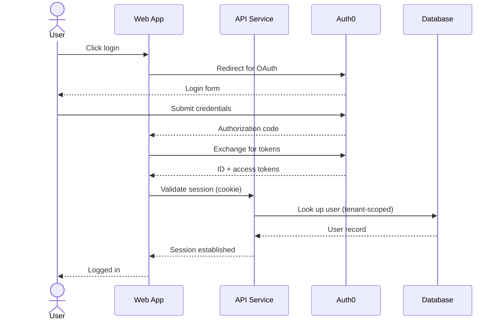
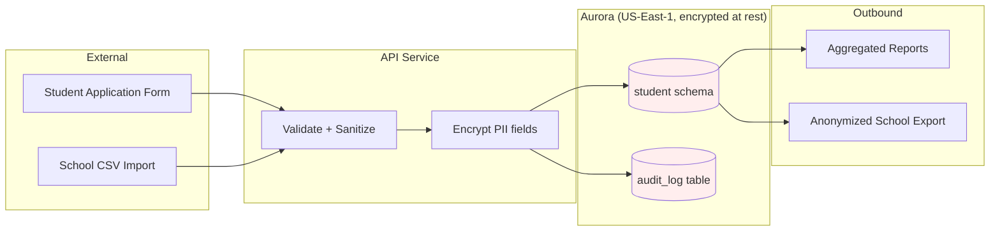

Generate architecture diagrams. Supports the C4 model's three
layers (context, container, component), plus sequence diagrams
for specific interactions and data flow diagrams for data
movement.

Diagrams are stored at
`design/diagrams/<level>-<scope>.<format>`. Format defaults to
mermaid (renders inline in most markdown viewers); plantuml is
supported for teams that prefer it.

This command often does double duty as the **architectural
identity capture** mechanism. The first run of
`/engineer:architecture:diagrams container` typically establishes
`.pencil-architecture.json` because identifying containers
forces explicit decisions about style, integration patterns,
and tech stack.

## C4 levels — what each one captures

### Context (C4 L1)

The system as a single box, surrounded by users (personas) and
external systems. Answers: "What does this system do at the
broadest level, and what does it interact with?"

Single context diagram per project. Updates rarely (only when
external integrations change).

### Container (C4 L2)

The system decomposed into deployable / runnable units —
applications, services, databases, file systems, message brokers.
Answers: "What are the major moving parts and how do they
communicate?"

Single container diagram per project. Updates when major
infrastructure changes (new service introduced, database
swapped, messaging platform changed).

### Component (C4 L3)

A single container decomposed into its internal components —
typically modules, packages, or major classes. Answers: "Inside
this service, what are the major components?"

One component diagram per container that has non-trivial
internal structure. Most projects don't need component diagrams
for every container; they're valuable for the most complex ones.

### Sequence (not strictly C4, but commonly paired)

Interaction-specific diagrams showing the temporal sequence of
calls/messages across containers. Answers: "When user does X,
what's the chain of events?"

One sequence diagram per significant interaction. Common targets:
authentication flow, checkout flow, multi-step business
processes, error/recovery flows.

### Data flow (also paired)

Data-centric diagrams showing how data moves between containers,
through transformations, into and out of stores. Answers:
"Where does this data live, and how does it travel?"

Especially valuable for projects with privacy / compliance
constraints (FERPA, GDPR, HIPAA) where data flow auditability
matters.

## Phase 0: discovery

1. Read `product/.pencil-architecture.json`. If missing, this is
   likely the first diagrams run — confirm with user before
   initializing. The first container diagram run will establish
   the manifest as a side effect.
2. Read `product/.pencil-decisions.json`. Any accepted ADRs that
   constrain architecture (multi-tenancy, integration patterns,
   tech stack pins) inform diagram content.
3. List existing diagrams in `design/diagrams/`. The command
   surfaces what already exists before generating new ones.

## Phase 1: scope selection

If `<level>` is `all`, the command produces context + container
diagrams (plus component diagrams for any containers explicitly
listed). It does NOT auto-generate sequence or data flow
diagrams — those require interaction-specific input.

If `<level>` is one of `context`, `container`, `component`,
`sequence`, `data-flow`, the command focuses on that level.

The `--scope` flag narrows further:

- For `component`: which container's internals (e.g.,
  `--scope app-service`)
- For `sequence`: which interaction (e.g.,
  `--scope user-login`)
- For `data-flow`: which data set (e.g., `--scope student-pii`)

If `--scope` is omitted for component/sequence/data-flow, the
command prompts for it.

## Phase 2: input gathering

Different levels require different inputs:

### Context level

- **System name** (from `.pencil-architecture.json` or prompt)
- **External actors** (users, third-party systems, identity
  providers, payment processors, etc.)
- **Inbound/outbound relationships** (what each actor does to
  the system, what the system does to each)

### Container level

- **Containers** (services, databases, message brokers, file
  stores, CDNs)
- **Container properties** per container:
  - Technology (e.g., "Spring Boot 3 + Java 21", "Next.js 15 +
    TypeScript", "PostgreSQL 15", "SQS")
  - Responsibility (1-2 sentences)
  - Deployment target (e.g., "ECS Fargate", "Aurora Serverless
    v2", "S3 + CloudFront")
- **Container relationships** (which containers talk to which,
  with protocol — HTTPS, gRPC, SQL, SQS, etc.)

If the project has Edwin-style polyglot structure, the command
helps map directories to containers:

> Detected polyglot project structure:
>
>   - app-ui/        → Next.js container
>   - app-service/   → Spring Boot container (Gradle)
>   - maven-dependency/  → Spring Boot containers (Maven reactor)
>   - .infra/        → infrastructure (not a container; deploys others)
>
> Confirm container mapping? Add or remove containers?

### Component level

- **Parent container** (from `--scope`)
- **Major components** within the container (modules, packages,
  domain services)
- **Inter-component relationships** (function calls, dependency
  injection, event subscriptions)

For Spring Boot containers, surface modules from
`settings.gradle` or parent POM `<modules>`. For Next.js
containers, surface route groups or app directory structure.

### Sequence level

- **Trigger** (what initiates the sequence — user click, API
  call, scheduled event, message)
- **Participants** (containers + external actors involved)
- **Messages** (ordered list of calls/responses with brief
  description)
- **Decision points or branches** (alt blocks)

### Data flow level

- **Data subject** (what data the diagram tracks — e.g.,
  "student PII", "session tokens", "billing records")
- **Sources** (where data enters the system)
- **Stores** (where data rests — databases, caches, file stores)
- **Sinks** (where data exits — third parties, exports, archive)
- **Transformations** (encryption, anonymization, aggregation
  steps)
- **Compliance constraints** (e.g., "must not leave US-region",
  "redacted before logs", "encrypted at rest")

## Phase 3: source generation

Generate mermaid (default) or plantuml source. Mermaid examples:

### Context (C4-Plant style with mermaid):

```
C4Context
  title System Context for SkoolScout

  Person(student, "Student", "Uses the platform to discover scholarships")
  Person(school, "School Admin", "Manages student records and applications")
  Person(coach, "Coach", "Reviews recruit profiles")

  System(skoolscout, "SkoolScout", "B2B ed-tech SaaS for student-school matching")

  System_Ext(stripe, "Stripe", "Payment processing")
  System_Ext(sendgrid, "SendGrid", "Transactional email")
  System_Ext(auth0, "Auth0", "Identity provider for school admins")

  Rel(student, skoolscout, "Browses scholarships, submits applications", "HTTPS")
  Rel(school, skoolscout, "Manages records, reviews applications", "HTTPS")
  Rel(coach, skoolscout, "Reviews recruit profiles", "HTTPS")

  Rel(skoolscout, stripe, "Processes subscription payments", "HTTPS/JSON")
  Rel(skoolscout, sendgrid, "Sends transactional emails", "HTTPS/JSON")
  Rel(skoolscout, auth0, "Authenticates school admins", "OAuth 2.0")
```

### Container diagram example:

```
C4Container
  title Container Diagram for SkoolScout

  Person(user, "User", "Student / Coach / Admin")

  System_Boundary(skoolscout, "SkoolScout") {
    Container(webapp, "Web App", "Next.js 15 + TypeScript", "Server-rendered web UI")
    Container(api, "API Service", "Spring Boot 3 + Java 21", "Business logic + multi-tenant data access")
    Container(modules, "Modules", "Spring Boot, Maven reactor", "mtauth, pojos2tables, requestcontext, ttcharts")
    ContainerDb(db, "Database", "Aurora Serverless v2 (Postgres)", "Schema-per-tenant data store")
    ContainerQueue(queue, "Event Queue", "AWS SQS", "Async user-event processing")
    Container(cdn, "CDN", "CloudFront", "Static asset delivery")
  }

  Rel(user, webapp, "Visits", "HTTPS")
  Rel(webapp, api, "Calls", "JSON/HTTPS")
  Rel(api, modules, "Uses (in-process)", "JVM")
  Rel(api, db, "Reads/writes", "JDBC/SQL")
  Rel(api, queue, "Publishes events", "SQS API")
  Rel(webapp, cdn, "Loads assets from", "HTTPS")
```

### Sequence diagram example:



### Data flow example:



## Phase 4: ADR cross-reference

After generation, cross-reference with `.pencil-decisions.json`:

- Containers / components / patterns shown in the diagram should
  trace back to accepted ADRs where applicable
- If the diagram shows something NOT covered by an ADR, surface:

  > Diagram shows multi-tenancy via schema-per-tenant
  > (ContainerDb annotation), but no accepted ADR documents this
  > decision. Consider running:
  >   /engineer:architecture:decisions:retrofit "Schema-per-tenant for
  >    multi-tenancy isolation" --tags multi-tenancy,data
  >   --evidence design/diagrams/container-skoolscout.mmd

- If the diagram contradicts an accepted ADR, this is more
  serious — flag as drift candidate for audit Plane 12c.

## Phase 5: architectural identity update

For container-level diagrams that reveal new identity facts (a
new style, a new integration pattern), surface a proposed
manifest update:

> The container diagram reveals these architectural identity
> elements not currently in `.pencil-architecture.json`:
>
>   - style: "modular-monolith" (single deployable, internal
>     module boundaries)
>   - integrationPatterns.byContext.user-events:
>     "async-messaging" (SQS introduction visible)
>
> Update the manifest? [Y/n]

If `--update` flag was provided, default is yes (with
confirmation still required). Without the flag, the user
explicitly chooses to update or not.

For first-run scenarios (no `.pencil-architecture.json` yet),
this is the moment to initialize the file.

## Phase 6: file write

Write the generated diagram source to:

- `design/diagrams/context-<system-slug>.<format>`
- `design/diagrams/container-<system-slug>.<format>`
- `design/diagrams/component-<container-slug>.<format>`
- `design/diagrams/sequence-<interaction-slug>.<format>`
- `design/diagrams/data-flow-<subject-slug>.<format>`

Format extensions: `.mmd` for mermaid, `.puml` for plantuml.

Also write a paired `.md` file alongside the diagram source with:

- Title and last-updated timestamp
- Embedded diagram (mermaid renders directly in markdown)
- Brief written description of what the diagram shows
- ADR cross-references (each accepted ADR that informs the
  diagram)
- Notes on what's intentionally omitted (no diagram is fully
  complete)

## Phase 7: report

```
Generated diagrams:
  context-skoolscout.mmd          → C4 Level 1 (system context)
  container-skoolscout.mmd        → C4 Level 2 (containers)

Architectural identity manifest:
  Initialized .pencil-architecture.json with detected facts:
    - style: modular-monolith
    - 6 containers identified
    - integrationPatterns: 2 entries

ADR cross-references:
  - container-skoolscout: references ADR-001, ADR-005
  - 1 candidate for ADR retrofit surfaced (multi-tenancy strategy)

Next steps:
  - Review generated diagrams; refine via /engineer:architecture:diagrams
    with --update flag
  - For undocumented decisions surfaced: run
    /engineer:architecture:decisions:retrofit
  - Generate sequence/data-flow diagrams for specific
    interactions or data subjects as needed
```

## Updates and refinement

When the architecture changes (new container, removed service,
new integration), re-run `/engineer:architecture:diagrams <level>
--update`. The command:

1. Reads the existing diagram source
2. Surfaces what's there
3. Prompts for the change (additions, removals, edits)
4. Generates the updated source
5. Diffs against existing
6. Confirms before writing

Diagram updates trigger audit Plane 12c (diagram staleness)
clearance — the staleness counter resets when the diagram is
updated.

## What this command does NOT do

- **Auto-generate diagrams from code introspection.** No
  static-analysis-based discovery of containers or components.
  The command structures input gathering but the user supplies
  the substance.
- **Validate diagram correctness against reality.** A diagram
  can show whatever the user wants. Audit Plane 12c surfaces
  staleness; it doesn't fact-check live diagrams.
- **Render diagrams to images.** Source files are produced;
  rendering is the markdown viewer's or build pipeline's job.
- **Maintain a single canonical "current" set of diagrams.**
  Multiple sequence and data-flow diagrams coexist (one per
  interaction / data subject); only context and container have
  single canonical instances per project.

## Examples

```bash
# First-run: establish container diagram + initialize architecture manifest
/engineer:architecture:diagrams container

# All C4 layers in one go (skips sequence/data-flow)
/engineer:architecture:diagrams all

# Component diagram for a specific service
/engineer:architecture:diagrams component --scope app-service

# Sequence diagram for the login flow
/engineer:architecture:diagrams sequence --scope user-login

# Data flow for student PII (compliance documentation)
/engineer:architecture:diagrams data-flow --scope student-pii

# Update existing container diagram after introducing a new service
/engineer:architecture:diagrams container --update
```
